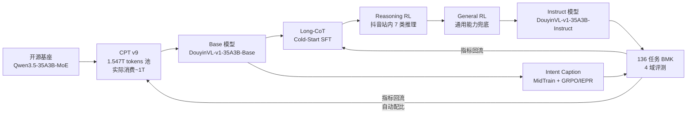

# DouyinVL 项目指南：从开源基座到抖音域 VLM 的全景与全部技术细节

> **阅读指引** — 本文是 DouyinVL-v1 项目在鞠少波 offer 面试语境下的**规范化教材**。写作依据是七份内部飞书文档、`resume_interview_knowledge_map.md` 简历知识地图，以及同目录下 vlm/distributed/moe/rlhf 等平行教程。所有可归因结论都注明来源；未在文档中披露的口径统一标注 **待确认**，不做主观推断。**团队级 benchmark 增益一律标注"团队版本"，个人贡献一律限定在数据/配比/稳定性/Caption 专项这几个可归因的窄口径上。**

> **本文档能回答的四类问题**：(1) DouyinVL 是什么、为什么这么做；(2) 数据、CPT、后训练、Caption 每一环的机制、公式、口径；(3) 千卡 910B NPU 上遇到的六类稳定性故障如何定位、修复、验证；(4) 面试里怎么区分个人贡献与团队结果、怎么讲 30 秒 / 3 分钟版本、怎么答 L1/L2/L3 追问。

## §0 TL;DR Cheat Sheet — 十二句话讲完 DouyinVL

> **要点：一页速通版**（详见 §1–§9 的推导、公式与故障复盘）。

1. **技术范式**：DouyinVL-v1 采用"**开源模型 + CPT + PostTrain**"多阶段范式，以 **Qwen3.5-35B-MoE-A3B** 作为能力基座（据《DouyinVL-v1 发版报告》）；相较从零训练同规模 VLM，这一路径通常成本与风险更低，属于**通用机制推演，非项目成本测算**。

2. **模型形态**：发版模型是 **DouyinVL-v1-35A3B-Base / Instruct**；"35A3B"表示约 **35B 总参数**、每 token 激活约 **3B** 参数的 MoE，由 routed experts 与 shared experts 通过 Router 协作 《鞠少波秋招简历知识地图》。

3. **CPT 数据配方**：CPT v9 配方池 **1.547T tokens / 约 888.73M 样本**，相较 Q1 版本新增约 **2 TB / 200M+ 样本**（据《DouyinVL 训练全流程梳理与简历写法建议》）。

4. **数据配比**：token 视角下**领域数据 ≈ 53.2%、通用开源 ≈ 46.8%**；模态视角下**多模态 ≈ 66.9%、纯文本 ≈ 30.3%、交错 ≈ 2.8%**（据《训练全流程梳理》）。

5. **实际训练消费**：CPT 阶段真实消费约 **1T tokens**，历时约 **12 天**，全局吞吐约 **77B tokens/day**，单卡约 **870 tokens/s/NPU**（据简历知识地图 & 《训练全流程梳理》）。

6. **千卡拓扑**：**1024 张 910B NPU**，二维 HSDP mesh = **8 路复制 × 128 路 FSDP shard**，`ulysses_size=1, ep_size=1, micro_bs=2, global_bs=2048`，因此**梯度累积 = 1**（据《训练全流程梳理》）。

7. **NPU 算子适配**：不是"统一适配层"，而是**分层 patch**——模型注册表返回 `patched_modeling_*_npu.py`，把 **RMSNorm / Gated RMSNorm / RoPE** 直接替换为 `torch_npu` 算子，并处理 HCCL 通信兼容（据《uni-recipes 910B NPU 算子适配代码分析》）。Dense-2B 同 batch 下**较 GPU 基线快约 12%**；MoE-35A3B 未优化时会因**利用率过低被调度频繁 kill** 《鞠少波秋招简历知识地图》。

8. **六类稳定性故障**：媒体解码（HEIF 静默损坏）、长视频采样（>128f 均匀重采样）、**媒体占位符与实际媒体数不一致**（Tensor Mismatch，根因是 OCR 文本里未转义的 `<image_pad>`）、坏样本导致的 loss spike、Loader OOM（`Streaming loader → BytedLoader + Lance/blob`）、算子/通信兼容（据《六类稳定性问题深度排障》）。

9. **量化收益**：Loader 切换 + HEIF/占位符/重采样修复后，**2k step 端到端 9h46m → 9h15m，平均 NPU 利用率 64.76% → 70.34%，SMA 50.64 → 55.34**（据《训练全流程梳理》）。

10. **PostTrain 三段课程**：**Long-CoT Cold-Start SFT → Reasoning RL → General RL**，先恢复思维模式，再拉专项推理天花板，最后 General RL 兜底通用能力 《DouyinVL 后训练全解与简历对齐手册》；混合奖励按任务类型路由到**规则评分 / LLM Judge / 专属 rubric** 三条路径，并用 `reward_type` 分桶监控实时防 Reward Hacking 《DouyinVL 后训练全解与简历对齐手册》。

11. **Intent Caption**：在**固定文本预算**下，按 Intent 保留"**下游有用 × 视觉可验证 × 非冗余**"的原子事实；数据链路是 9 类 Evidence QA + Visual QA + Blind QA + Claim Validation 多重门禁；训练用 **GRPO** + 多目标奖励 **IEPR = w_r·R_evidence + w_p·R_precision + w_i·R_intent + w_l·R_length − w_d·R_redundancy** 《鞠少波秋招简历知识地图》。

12. **评测口径**：**136 个独立评测任务、42 个业务任务**，分四域（开源通用 / 抖音通用 / 抖音推理 / 抖音知识）（据《训练全流程梳理》）；**DouyinVL-v1-35A3B-Instruct vs Qwen3.5 基座整体 +10.98pt、抖音推理 +46.91pt，为团队版本口径**，个人贡献表述必须限定在数据 / 配比 / 稳定性 / Caption 专项 《鞠少波秋招简历知识地图》。

---

## §1 项目全景与技术主线

### 1.1 一句话定位

**DouyinVL 是抖音域的多模态大模型（VLM）项目，目标是让一个"能看图、能看视频"的 LLM 具备抖音站内的搜索 / 推荐 / 问答能力**。发版模型是 `DouyinVL-v1-35A3B-Base` 与 `DouyinVL-v1-35A3B-Instruct`，产物路径落在 `hdfs://haruna/home/byte_mlsys_ssd_lfrz_douyincud/DouyinVL-release/`（据《DouyinVL-v1 发版报告》）。

### 1.2 为什么走"开源基座 + CPT + PostTrain"，而不是从零训

三段式的**判断依据**：

- **能力基座已经足够**：Qwen3.5-35B-MoE-A3B 是成熟的开源能力基座；项目据此选择多阶段范式，而非从零训练同规模 VLM（据《DouyinVL-v1 发版报告》）。从零训练同规模模型通常成本显著高于在成熟基座上做 CPT，**这是通用机制推演，并非发版报告披露的成本测算**。
- **CPT 只补"抖音域"这一块**：CPT 的角色不是"重训能力"，而是"把开源模型的能力分布**往抖音语料域拉近**"；因此配方是**领域数据 ≈ 53%、通用开源 ≈ 47%**——既灌抖音域，也用 47% 通用开源做"通用能力防线"，避免灾难性遗忘（据《训练全流程梳理》）。
- **PostTrain 走三段课程**：Cold-Start SFT 恢复思维模式 → Reasoning RL 拉抖音推理天花板 → General RL 兜底通用能力，配合**混合奖励**避免单一 rubric 崩塌 《DouyinVL 后训练全解与简历对齐手册》。
- **Intent Caption 是独立专项通路**：用 MidTrain / SFT + GRPO 训一个"意图感知的视觉事实压缩器"，供下游搜索、推荐、问答复用 《鞠少波秋招简历知识地图》。

### 1.3 端到端闭环（文本流程图，Markdown 渲染兼容）



> **要点：闭环的关键在"回流"**——评测不是终点，而是**下一轮数据配比（自动 token 配比、抖音知识图文 79.72 → 82.37）与后训练课程调整的输入**（据《DouyinVL 后训练全解与简历对齐手册》）。

### 1.4 项目事实速览卡

| 维度 | 数值 / 内容 | 来源 |
| --- | --- | --- |
| 基座 | Qwen3.5-35B-MoE-A3B（35B 总参 / 3B 激活） | 发版报告 & 《鞠少波秋招简历知识地图》 |
| CPT 池 | 1.547T tokens / 888.73M 样本 | 《训练全流程梳理》 |
| 实际消费 | ~1T tokens / ~12 天 / 77B tokens/day | 《训练全流程梳理》 & 简历知识地图 |
| 集群 | 1024 张 910B NPU | 《训练全流程梳理》 |
| Mesh | 8 replicate × 128 FSDP shard（HSDP） | 《训练全流程梳理》 |
| Batch | micro=2, global=2048, grad_accum=1 | 《训练全流程梳理》 |
| 后训练 | Long-CoT SFT → Reasoning RL → General RL | 《DouyinVL 后训练全解与简历对齐手册》 |
| BMK | 136 任务 / 42 业务任务 / 4 域 50 子维度 | 《训练全流程梳理》 & 发版报告 |
| 团队增益 | 整体 +10.98pt；抖音推理 +46.91pt | 发版报告 |
| Intent Caption BMK | 399 样本 / 2,127 图 / 2,692 QA / 187 世界知识 | 《抖音知识 Intent Caption Benchmark V1：构造方法、数据结构与评测口径》 |

---

## §2 数据与 CPT 全链路

### 2.1 CPT 的目标口径

CPT（Continual Pre-Training）在 DouyinVL 里做**三件事**：(1) 把开源基座的知识分布拉到抖音域；(2) 用 Option Shuffle / 文本 Dropout 等策略消除位置偏置、迫使视觉依赖；(3) 建立稳定的 token 消费 pipeline 供后训练复用（据《训练全流程梳理》）。

### 2.2 数据规模、配比与结构

**总量**：CPT v9 数据配方池 **1.547T tokens、约 888.73M 样本**，相较 Q1 版本新增约 **2 TB / 200M+ 样本**（据《训练全流程梳理》）。

**双视角配比**：按 token / 来源看，领域数据约 **53.2%**，通用开源约 **46.8%**；按 token / 模态看，多模态约 **66.9%**，纯文本约 **30.3%**，交错数据约 **2.8%**。领域数据包括抖音站内视频、图文、OCR/ASR 抽取；通用开源包括通用图文、通用视频与纯文本。来源：《训练全流程梳理》。

> **口径纪律**：**"1.547T tokens"是数据池规模，"1T tokens"是实际训练消费量**——两者不是同一个数字。**面试时严禁把 1.547T 说成"训练消耗"**（据《训练全流程梳理》 & 简历知识地图）。

### 2.3 质量治理：Option Shuffle、文本 Dropout 与"脏活"

**Option Shuffle**：随机打乱 MCQ 选项并同步重写答案标签，破坏"答案总在 A"这类位置偏置（据《训练全流程梳理》）。

**文本 Dropout**：以一定概率丢弃 OCR / ASR / Title / Tags 等字段，**迫使模型学会从视觉证据出发**而不是把 OCR 抄一遍（据《训练全流程梳理》）。

**"脏活"清单**（据《训练全流程梳理》 & 《六类稳定性问题深度排障》）：

- **HEIF 解码**：PIL 读 HEIF 图**不报错但内容错误**（静默损坏），需要显式修复。
- **长视频均匀重采样**：超过 **128 帧**的样本必须做均匀重采样，解决**显存 / Token 预算超标**。
- **媒体数量 ↔ 占位符数量对齐**：任意样本里 `<image_pad>` / `<video_pad>` 占位符个数必须等于实际 media 数；OCR 文本里出现的字面 `<image_pad>` 会导致运行时 Tensor Mismatch。

> **待确认（映射 gaps.md）**：HEIF 修复的具体工程位置（替换解码后端 / 前置校验 / 绕开 PIL 用 libheif）、坏样本自动检测阈值、占位符一致性是离线清洗还是运行时 schema 校验——**内部文档均未明说**。面试时应表述为"知道要修、修完 SMA 上去了，具体实现细节以内部代码为准"。

### 2.4 训练配置（唯一的一张训练配置表）

| 参数 | 值 | 说明 |
| --- | --- | --- |
| 集群 | 1024 × Ascend 910B NPU | 团队产能上限 |
| 并行 | FSDP2 full shard | 权重 / 梯度 / 优化器都 shard |
| `dp_replicate_size` | 8 | HSDP 的"复制"维 |
| `dp_shard_size` | 128 | HSDP 的"分片"维（1024 / 8） |
| `ulysses_size` | 1 | 未启用 Ulysses SP |
| `ep_size` | 1 | 未启用 Expert Parallel |
| `micro_batch_size` | 2 | 单 rank 单 step |
| `global_batch_size` | 2048 | 全局 batch |
| `grad_accumulation` | 1 | 由 2048 / (1024·2) 推出 |

来源：《训练全流程梳理》与《鞠少波秋招简历知识地图》。

**数字自洽验算**：
$$
\text{grad\_accum} = \frac{\text{global\_bs}}{\text{world\_size} \times \text{micro\_bs}} = \frac{2048}{1024 \times 2} = 1
$$
$$
\text{单卡吞吐} \approx \frac{77 \times 10^9\ \text{tokens/day}}{1024\ \text{NPU} \times 86400\ \text{s/day}} \approx 870\ \text{tokens/s/NPU}
$$

（单卡吞吐由全局吞吐与 NPU 数量换算，据《训练全流程梳理》。）

### 2.5 CPT 结果口径（团队级）

**DouyinVL-v1-35A3B-Instruct vs Qwen3.5 基座**（据《DouyinVL-v1 发版报告》）：

- **整体平均 +10.98pt**。
- **TikTok Reasoning +46.91pt**（最强增益项，是 CPT + Reasoning RL 联合作用的结果）。

---

## §3 千卡 910B NPU 训练与六类稳定性

### 3.1 HSDP mesh 的物理与语义

**结构**：1024 NPU = **8 replicated groups × 128-way FSDP shard**（据《训练全流程梳理》与《鞠少波秋招简历知识地图》）。**含义**：

- **shard 维（128）**与 **replicate 维（8）**的项目事实仅限于上述 mesh 配置。

> **通用机制推演（项目文档未披露物理拓扑）**：按 HSDP 的一般工作方式，shard 维会涉及参数 all-gather 与梯度 reduce-scatter，replicate 维会做梯度同步；把 shard 范围限制为 128 卡，理论上可避免 1024 卡全局分片的通信放大。但"是否位于同一高带宽域"、具体通信路径与收益量均须以实际拓扑和 profiling 为准。

$$
\text{world\_size} = \text{dp\_replicate\_size} \times \text{dp\_shard\_size} = 8 \times 128 = 1024
$$

### 3.2 关键量的相互约束

关键约束可写为：全局 tokens/step = **2048 × seq_len**；`grad_accum = global_bs / (world_size × micro_bs) = 1`；由全局约 **77B tokens/day** 换算，单卡吞吐约 **870 tokens/s/NPU**。

**为什么 grad_accum=1 重要**：意味着**一次 forward-backward 就完成一个 optimizer.step**，通信与计算的 overlap 完全落在单个 step 内；也意味着**任何单 step 的 loss spike 会立即反映在优化器状态里**，坏样本治理必须在 loader 层解决。

### 3.3 NPU 算子适配：已披露三层与通用推演

据《uni-recipes 910B NPU 算子适配代码分析》，NPU 迁移**不是**在一个"统一适配层"里完成。现有证据明确披露至少三层：

1. **模型 registry 替换**：训练脚本注册的 model type 返回 `patched_modeling_*_npu.py`，从入口切到 NPU 版实现。
2. **函数级 patch（关键算子）**：**RMSNorm、Gated RMSNorm、RoPE** 替换为 `torch_npu` 算子。
3. **分布式兼容**：处理 **HCCL** 通信兼容。

> **通用机制推演（内部代码为准）**：配置分发与数值一致性通常也是异构设备适配需要处理的路径，但现有证据未披露其具体 hook、dtype 策略、误差阈值或复现要求，因此不能写成 DouyinVL 已披露的固定分层。

**收益量化**：Dense-2B 通过 XPU 算子适配后，**同 batch 下训练速度较 GPU 基线快约 12%**；**MoE-35A3B 未做适配时会因利用率过低被调度频繁 kill**（据《六类稳定性问题深度排障》与《鞠少波秋招简历知识地图》）。

> **待确认（gaps）**：除 RMSNorm、Gated RMSNorm、RoPE 外，具体算子完整清单（GMM、Permute/Unpermute 等）、NPU vs GPU 单算子 / 单 step 的数值对齐误差阈值（如 FP16 bit-wise 要求）**未在文档披露**。面试时应表述为"已披露至少三层适配；配置分发与数值一致性仅按通用机制推演，具体实现以内部代码为准"。

### 3.4 六类稳定性问题：诊断→修复→验证

**诊断信号（联合观测的四类量）**：显著低利用率占比、平均 NPU 利用率、**SMA（内部稳定性观测指标，缩写含义待确认）**、2k step 端到端用时（据《六类稳定性问题深度排障》）。

| 编号 | 问题类别 | 现象 | 诊断信号 | 修复动作 | 事实边界 |
| --- | --- | --- | --- | --- | --- |
| P1 | **算子 / 通信** | MoE-35A3B 反复被 kill；利用率长时间低 | 平均利用率 < 阈值、job hang | 走 §3.3 已披露的三层适配；将 norm / RoPE 替换为 torch_npu 算子 | 待确认：单算子精度阈值未披露 |
| P2 | **媒体解码（HEIF）** | 部分样本进模型后 loss 异常，图像看起来"糊" | 单机 debug loader 复现；比对解码前后图像 hash | 明确修复 HEIF 静默损坏（据《六类稳定性问题深度排障》） | 修复位置（后端替换 / 前置校验 / libheif）未披露 |
| P3 | **长视频采样** | OOM / Token 预算爆掉 | 显存曲线尖峰、seq_len 超过预算 | **>128f 均匀重采样** | 采样上限 128f 是硬约束 |
| P4 | **媒体占位符不一致** | 运行时 **Tensor Mismatch** | debug dataloader 单机复现问题 batch | 定位到 OCR 文本里未转义的 `<image_pad>`；对齐 media 数与占位符数 | 校验落在离线 / 运行时哪一层未披露 |
| P5 | **坏样本 / loss spike** | 单 step loss 异常放大 | grad-norm 尖峰、loss curve 抖动 | 坏样本过滤（黑名单 / 特征过滤） | 具体自动检测阈值与是否回滚未披露 |
| P6 | **Loader OOM** | `num_workers=2` 触发 OOM | 主机内存曲线；worker 进程 RSS 爆掉 | **`Streaming loader → BytedLoader + Lance（blob 存储）`** | 切换后收益可量化（§3.5） |

> **要点：诊断顺序**：先看 SMA / 利用率整体面（有没有系统性抖动） → 再看 grad-norm / loss 曲线（是不是坏样本） → 再看 host 内存 / dataloader 进程（是不是 Loader）→ 最后单机 debug loader 复现 problem batch（找占位符 / HEIF 这种静默错）。

### 3.5 稳定性治理的量化收益（唯一权威的一组对比数）

**Loader 切换 + HEIF / 重采样 / 占位符修复**后，2k step 端到端用时由 **9h46m 降至 9h15m（−31 min）**，平均 NPU 利用率由 **64.76% 升至 70.34%（+5.58 pt）**，SMA 由 **50.64 升至 55.34（+4.70 pt）**（据《训练全流程梳理》）。

这三个数字是"稳定性治理"贡献的**权威口径**——在简历和面试中以此为准，不要说成"提升吞吐"或"提升 MFU"这类容易被追问不清的表述。

> **待确认（gaps）**：显著低利用率占比的**具体判定阈值**、job hang 判定的**超时时间**、以及"平均利用率"是否包括 comm 时间——文档未披露，属于**通用机制理解**。

---

## §4 PostTrain 与 Intent Caption 闭环

### 4.1 三段课程：为什么这样排

后训练课程被拆成三段递进 《DouyinVL 后训练全解与简历对齐手册》：

1. **Long-CoT Cold-Start SFT**：先用长思维链 SFT 把"思考模式"**恢复**——CPT 后模型可能会失去主动生成 CoT 的分布，直接上 RL 会导致奖励信号无处附着。
2. **Reasoning RL**：拉抖音站内 **7 类推理任务**（意图推理 / 关键词生成 / 不存在信息识别 / 证据定位 / 对比推理 / 忠实性判断 / 跨片段推理）的天花板（据《DouyinVL 后训练全解》）。
3. **General RL**：兜底通用能力，防止"抖音专项掉通用"。

### 4.2 混合奖励系统

据《DouyinVL 后训练全解》& 《DouyinVL 后训练全解与简历对齐手册》，混合奖励按任务类型路由到三条打分路径：

- **规则评分**：客观题、证据定位这种可机械判分的任务。
- **LLM Judge**：Caption / 开放推理这种需要语义评估的任务。
- **专属 rubric**：Intent Caption 等专项任务用**多目标 rubric**（见 §4.4 IEPR）。

**Reward Hacking 兜底**：使用 `reward_type` **分桶监控** 《DouyinVL 后训练全解与简历对齐手册》——把不同奖励类型的分数分布分开监控，一旦某个桶出现异常（如某类任务 reward 在几个 step 内飙升），实时触发人工审计。

> **待确认（gaps）**：具体的 **RL 优化算法**（PPO / GRPO / DPO 选型）、**Thinking Reward vs Answer Reward 的融合权重**、采样超参（rollout 数、温度、GAE 参数）、归一化区间——**发版报告未披露** 《DouyinVL 后训练全解与简历对齐手册》。**面试时按"通用机制理解 + 以官方披露为准"表述**。

### 4.3 自动配比与业务对齐

**自动 Token 配比**在 CPT / PostTrain 之间形成回流：抖音知识图文指标 **79.72 → 82.37（+2.65pt）**，自动配比总平均 **79.28 → 79.87**（据《DouyinVL 后训练全解》）。

**七类抖音站内推理任务** 《DouyinVL 后训练全解与简历对齐手册》 覆盖搜索 / 推荐 / 问答的核心能力面，见 4.1 列表。

**CoT 数据规模化生产**：搭建了**自动化 CoT 生产链路**，按"问题复杂度 × 思考多样性"组织样本生成，并做**批量代码自动迁移**（把"能跑通的 demo"自动搬到实际数据流水线），以规模化上量（据《DouyinVL 后训练全解》）。

### 4.4 Intent Caption：定义、数据、奖励、训练

**定义（严格版）**：Intent Caption 是"**在固定文本预算下，根据 Intent 保留对下游决策有用、视觉可验证、非冗余的原子事实**" 《鞠少波秋招简历知识地图》。三个约束缺一不可：

- **下游决策有用**（intent-aware）——不是"看图说话"，是"这次要给推荐 / 搜索用"。
- **视觉可验证**（evidence-grounded）——每一条 claim 必须能落到 pixel / frame。
- **非冗余**（compact）——固定预算下不能重复。

**数据生产链路** 《鞠少波秋招简历知识地图》：

```
源视觉样本 → Intent 构造 → 9 类 Evidence QA
        → Visual QA 验证（视觉依赖：看图能答→合法）
        → Blind QA 验证（不看图能答→踢除，避免"文本可猜"）
        → Claim Validation（事实一致性）
        → World Knowledge 标注
```

**MidTrain 数据构造** 《Caption MidTrain 方案》：用**多个 Judge 模型交替添加 claim**，走"**视觉事实池 → Caption**"的逻辑，最终做**双重质量门控**：
- **看图应答**支持 → 证明该 claim 合法；
- **不看图应答**支持 → 证明该 claim 非法（否则说明它是"文本可猜"）。

**信息密度指标** 《Caption MidTrain 方案》：
$$
\text{Density} = \frac{\text{被 QA 或视觉证据支持的有效事实数}}{\text{Caption 字符数}}
$$
用它防止模型形成"长而空"的输出分布。

**多目标奖励 IEPR（Intent-aware Evidence Preservation Reward）** 《鞠少波秋招简历知识地图》：
$$
R_{\text{IEPR}} = w_r R_{\text{evidence}} + w_p R_{\text{precision}} + w_i R_{\text{intent}} + w_l R_{\text{length}} - w_d R_{\text{redundancy}}
$$

- $R_{\text{evidence}}$：**证据召回**（覆盖了多少 gold facts）。
- $R_{\text{precision}}$：**准确率**（生成的 claim 有几条能被视觉证据支持）。
- $R_{\text{intent}}$：**意图相关性**（生成内容是否服务 intent）。
- $R_{\text{length}}$：**长度效率**（每单位 token 的信息含量）。
- $R_{\text{redundancy}}$：**冗余惩罚**（同义 claim 只算一次）。

> **待确认**：IEPR 的具体 $w_*$ 权重、归一化区间在文档中未给出。面试按"多目标加权 - 冗余惩罚"讲机制，权重"以内部代码为准"。

**GRPO 训练** 《鞠少波秋招简历知识地图》：对同一 prompt 采样一组响应，组内相对标准化 advantage：
$$
A_i = \frac{r_i - \mu_G}{\sigma_G + \varepsilon}
$$
优点：**无 value network**（去 critic）、显存 / 计算成本低、天然吃"相对偏好"，与多目标 reward 组合稳定。

### 4.5 Intent Caption Benchmark V1（评测口径）

据《抖音知识 Intent Caption Benchmark V1：构造方法、数据结构与评测口径》：

| 项 | 值 |
| --- | --- |
| 样本数 | 399 |
| 图片数 | 2,127 |
| 通用 QA | 2,692 |
| 世界知识题 | 187 |

**综合分权重** 《抖音知识 Intent Caption Benchmark V1：构造方法、数据结构与评测口径》：**Recall = 0.50（最高）**，**Precision = 0.30（门控）**，**Relevance = 0.20**，**Efficiency 仅做弱调节**。

> **已识别风险**（据 《抖音知识 Intent Caption Benchmark V1：构造方法、数据结构与评测口径》）：BMK V1 仍存在 **Intent 泄漏**风险（gold intent 与 gold caption 相互泄漏）、**世界知识目标与视觉事实目标混杂**（部分题需要外部知识才能答）。**解读结果时应按分项指标而非只看总分**。

**训练指标趋势**（据 《鞠少波秋招简历知识地图》）：Intent Caption 训练前后 **Reward +13.22pp、QA Recall +16.75pp、幻觉率 −2.63pp**。

> **口径 caveat**：这些数字来自**单次迭代过程中的前后对比**（trend），**缺乏 held-out 上严格配对的 Step0 vs StepN 因果增益**（据 gaps 《鞠少波秋招简历知识地图》）。面试表述："在训练观测口径下 Reward 提了 +13.22pp、QA Recall 提了 +16.75pp、幻觉率降了 −2.63pp；严格 held-out 因果分析仍在补齐"。

---

## §5 评测体系与关键结果口径

### 5.1 136 任务 / 42 业务任务 / 四大域

据《训练全流程梳理》 & 发版报告：**136 个独立评测任务、42 个业务任务**，分为四类评测域：

- **开源图像**：通用能力"防线"（防灾难遗忘）。
- **开源视频**：通用能力"防线"。
- **抖音通用 / 抖音推理 / 抖音知识**：作为"进攻性指标"，衡量抖音域能力。

**50 个子维度**围绕通用 / 知识 / 推理三大类展开（据发版报告）。

### 5.2 团队级增益一览

| 域 | Δ vs Qwen3.5 基座 | 说明 |
| --- | --- | --- |
| 整体平均 | **+10.98pt** | 团队版本 |
| **抖音推理** | **+46.91pt** | 最强增益项 |

**其它子项**：抖音知识图文经自动配比 **79.72 → 82.37**（+2.65pt）；自动配比总平均 **79.28 → 79.87**（据《DouyinVL 后训练全解》）。

### 5.3 结果解读的口径纪律

- **"整体 +10.98pt / 抖音推理 +46.91pt"是团队版本**——包含 CPT、SFT、RL、稳定性、数据配比的**联合贡献**，不是任何单人可归因的增益 《鞠少波秋招简历知识地图》。
- **个人可归因的窄口径**：数据链路 / 配比优化 / 稳定性治理 / Caption 专项这四条通路（详见 §6）。

---

## §6 贡献边界、数字防守表与叙述模板

### 6.1 个人 vs 团队的可归因边界

据《鞠少波秋招简历知识地图》的原话："**DouyinVL 最终 benchmark 增益是团队版本结果。个人参与是协同 / 部分参与，不表述为全链路独立 owner**"。据此：

**个人可归因（表述为"我做了 X，量化收益 Y"）**：

- **数据链路**：参与 CPT v9 数据配方、Option Shuffle、文本 Dropout 策略与脏活修复；对应 v9 池 **1.547T tokens / 888.73M 样本**，相对 Q1 新增约 **2 TB**。
- **配比优化**：参与自动 token 配比机制；抖音知识图文 **79.72 → 82.37**，自动配比总平均 **79.28 → 79.87**。
- **稳定性治理**：参与 Loader 切换及 HEIF / 重采样 / 占位符修复；2k step **9h46m → 9h15m**，利用率 **64.76 → 70.34**，SMA **50.64 → 55.34**。
- **Intent Caption 专项**：参与 MidTrain 数据、IEPR、GRPO 训练；Reward **+13.22pp**、QA Recall **+16.75pp**、幻觉 **−2.63pp**（trend 口径）。

**团队可归因**：团队版本 DouyinVL-v1 相对基座整体 **+10.98pt**、抖音推理 **+46.91pt**；BMK 建设覆盖 **136 任务 / 42 业务任务 / 4 域 50 子维度**。

**不可归因（不要主动认领）**：Reasoning RL 具体算法选型、Thinking / Answer Reward 融合权重、NPU 融合算子精确清单——**这些是 gaps 里的空白**，官方口径没披露。

### 6.2 数字防守表（背下来）

| 数字 | 出处 | 边界 | 常见错误说法 |
| --- | --- | --- | --- |
| 1024 NPU | 集群规模 | 910B，非 A100 | 说成"1024 GPU" |
| 8 × 128 HSDP | mesh 拓扑 | dp_replicate × dp_shard | 说成"1024 全局 FSDP" |
| micro=2 / global=2048 / accum=1 | 训练配置 | 由 2048/(1024·2) 推导 | 说 "accum > 1" |
| 1.547T tokens | CPT 池 | **配方池规模** | 说成"训练消耗" |
| 1T tokens | 实际消费 | **真实训练消费** | 说成"数据总量" |
| 12 天 / 77B tokens/day | 训练时长 / 吞吐 | 全局吞吐 | 说成单卡吞吐 |
| ~870 tokens/s/NPU | 单卡吞吐 | 77B / (1024·86400) | 记不清就现推 |
| Loader 收益 9h46→9h15 / 64.76→70.34 / 50.64→55.34 | 稳定性收益 | 权威三组数 | 不要口径含糊 |
| +10.98pt / +46.91pt | 团队增益 | Instruct vs Qwen3.5 基座 | **说成个人成绩** |
| 136 任务 / 42 业务任务 | BMK | 四域 / 50 子维度 | 说成"136 benchmarks" |
| 399 / 2,127 / 2,692 / 187 | Intent Caption BMK | 《抖音知识 Intent Caption Benchmark V1：构造方法、数据结构与评测口径》 | 与 CPT 数据混说 |
| +13.22pp / +16.75pp / −2.63pp | Intent Caption trend | 单次迭代前后 | 说成"held-out 因果收益" |

### 6.3 30 秒版本

> "DouyinVL 是抖音域的多模态大模型，走**开源 Qwen3.5-35A3B MoE 基座 + CPT + PostTrain** 三段范式。我在**1024 张 910B NPU** 上参与了 **CPT v9 数据配方（1.547T tokens 池、实际消费 ~1T）、稳定性治理（Loader 切换 + HEIF / 长视频重采样 / 媒体占位符修复，把 2k step 从 9h46 降到 9h15、平均利用率从 64.76 提到 70.34、SMA 从 50.64 提到 55.34）**，以及 **Intent Caption 专项（MidTrain 数据 + IEPR 多目标奖励 + GRPO 训练）**。团队版本相对基座整体 +10.98pt、抖音推理 +46.91pt；个人贡献限定在数据 / 配比 / 稳定性 / Caption 这四条通路。"

### 6.4 3 分钟版本（结构化叙述模板）

1. **【项目定位 · 30s】** 我参与的是 DouyinVL-v1，抖音域多模态大模型。选型上没有从零训，而是走"开源 Qwen3.5-35B-MoE-A3B 基座 + CPT + PostTrain"三段范式。发版报告披露的是采用成熟开源模型作为能力基座；"从零训练同规模模型成本显著更高"属于通用机制推演，不是项目成本测算。
2. **【训练规模 · 40s】** CPT 用 1024 张 910B NPU、8 复制 × 128 FSDP shard 的 HSDP mesh，micro=2、global=2048、grad_accum=1，实际消费 ~1T tokens、12 天、单卡约 870 tokens/s。数据配方池 1.547T tokens、888.73M 样本，token 视角领域 53.2% / 通用 46.8%，模态视角多模态 66.9% / 纯文本 30.3%。
3. **【稳定性 · 40s】** CPT 期间遇到六类问题：算子 / 通信（已披露模型 registry、关键算子 patch、HCCL 兼容至少三层；配置分发与数值一致性是通用推演）、HEIF 静默损坏、>128f 长视频均匀重采样、OCR 里未转义 `<image_pad>` 导致 Tensor Mismatch、坏样本 loss spike、Streaming loader OOM。修复后端到端 2k step 从 9h46 降到 9h15、利用率从 64.76 提到 70.34、SMA 从 50.64 提到 55.34。
4. **【后训练 · 40s】** PostTrain 走 Long-CoT SFT → Reasoning RL → General RL 三段课程，混合奖励按任务类型路由到规则 / LLM Judge / 专属 rubric，用 `reward_type` 分桶防 Reward Hacking。Intent Caption 是我参与的专项：MidTrain 用视觉事实池 + 双重质量门控生产数据，训练用 GRPO + IEPR 多目标奖励（证据召回、准确率、意图相关性、长度效率、冗余惩罚）。
5. **【结果 · 30s】** 团队版本相对基座整体 +10.98pt、抖音推理 +46.91pt，136 任务 / 42 业务任务 / 4 域评测。Intent Caption BMK 399 样本、Reward +13.22pp、QA Recall +16.75pp、幻觉 −2.63pp（trend 口径）。
6. **【贡献边界 · 20s】** 团队增益是团队结果；我个人可归因的是数据链路、配比、稳定性、Caption 专项这四条通路；RL 具体算法选型、融合权重等 gap 项以内部披露为准，不主观补全。

---

## §7 关联知识点学习地图（映射仓库其他教程）

DouyinVL 涉及的知识都在仓库现有教程里能找到平行素材：

| 知识点 | DouyinVL 里的位置 | 仓库对应教程 |
| --- | --- | --- |
| ViT / patch tokenize / 动态分辨率 / M-RoPE | 视觉编码链路 《鞠少波秋招简历知识地图》 | `vlm_multimodal_tutorial.md` §2 / §10 |
| CLIP / SigLIP 对齐机制 | Intent Caption 视觉依赖验证 | `vlm_multimodal_tutorial.md` §3 / §4 |
| LLaVA projector / 2-stage 训练 | Base → Instruct 阶段 | `vlm_multimodal_tutorial.md` §6 |
| MoE Router / 激活参数 | 35A3B 架构本身 《鞠少波秋招简历知识地图》 | `moe_tutorial.md` |
| FSDP / HSDP / grad_accum | 千卡训练配置 | `distributed_training_tutorial.md` |
| RMSNorm / RoPE | NPU 已披露关键算子 patch | `normalization_init_tutorial.md` / `long_context_rope_yarn_mla_tutorial.md` |
| PPO / GRPO / DPO / KL | Reasoning RL + Intent Caption GRPO | `rlhf_dpo_grpo_ppo_tutorial.md` / `kl_divergence_rlhf_tutorial.md` |
| Reward Hacking / LLM Judge | 混合奖励系统 《DouyinVL 后训练全解与简历对齐手册》 | `rlhf_dpo_grpo_ppo_tutorial.md` / `llm_evaluation_benchmarking_tutorial.md` |
| Long-CoT / Reasoning 模型 | Long-CoT Cold-Start SFT | `reasoning_models_tutorial.md` |
| 长视频采样 / 视觉 token 压缩 | >128f 重采样、ForestPrune 《鞠少波秋招简历知识地图》 | `vlm_multimodal_tutorial.md` §11 |
| 蒸馏 / CAPD | 反事实影响校准 On-Policy 蒸馏 《鞠少波秋招简历知识地图》 | `diffusion_distillation_tutorial.md`（方法论平行） |

**推荐阅读顺序**（面试前一周）：`moe_tutorial` → `distributed_training_tutorial` → `vlm_multimodal_tutorial` → `rlhf_dpo_grpo_ppo_tutorial` → 本文（DouyinVL 项目指南）→ 简历知识地图（复盘个人贡献）。

**外围技术亮点（可选谈资）** 《鞠少波秋招简历知识地图》：
- **ForestPrune**：跨帧视频视觉 token 压缩方法，构建 token trees / forest，用树深与节点角色估计重要性，**压缩 90% 保留 95.8% 平均准确率**。
- **CAPD（Counterfactual-Aware Policy Distillation）**：逐组移除连续时间片段 x\g，计算影响 $I_g = D(p_{\text{full}}, p_{\text{minus\_g}})$，用 $I_g$ 校准 teacher 的 attention policy，从而把"时间定位"能力迁给 student。

---

## §8 分级面试题与简答（L1 必会 · L2 进阶 · L3 顶级追问）

### 8.1 L1 · 必答（项目事实）

**Q1. DouyinVL 是什么？为什么选 Qwen3.5-35B-MoE-A3B？**
A. 抖音域 VLM，走"开源基座 + CPT + PostTrain"。选 35A3B 是因为它总参 35B / 激活 3B，训练 / 推理都有 MoE 的稀疏红利，同时通用能力已经很强，CPT 补抖音域即可（据发版报告 & 《鞠少波秋招简历知识地图》）。

**Q2. CPT 用了多少卡多少数据多久？**
A. 1024 张 910B NPU、CPT v9 池 1.547T tokens / 888.73M 样本，实际消费 ~1T tokens、12 天、全局吞吐 ~77B tokens/day、单卡 ~870 tokens/s（据《训练全流程梳理》& 简历知识地图）。

**Q3. 团队 benchmark 增益？**
A. 团队版本 DouyinVL-v1-35A3B-Instruct 相对 Qwen3.5 基座整体 +10.98pt、抖音推理 +46.91pt；136 任务 / 42 业务任务 / 4 域评测（据发版报告与《训练全流程梳理》）。**这是团队版本口径**。

**Q4. 你个人做了什么？**
A. 参与 CPT v9 数据配方（Option Shuffle、文本 Dropout、脏活修复）、自动 token 配比（抖音知识图文 79.72 → 82.37）、稳定性治理（Loader 切换 + HEIF / 重采样 / 占位符修复，2k step 9h46 → 9h15、利用率 64.76 → 70.34、SMA 50.64 → 55.34）、Intent Caption 专项（MidTrain 数据 + IEPR + GRPO）。**团队增益不认领为个人成绩** 《鞠少波秋招简历知识地图》。

### 8.2 L2 · 进阶（机制与公式）

**Q5. HSDP 为什么 8 × 128 而不是 1024 全局 FSDP？**
A. 项目证据只披露 **8 × 128 HSDP mesh**。**通用机制推演**：限制 shard 规模通常可减少相对 1024 卡全局 FSDP 的通信放大，但具体通信域、路径和收益需要结合实际物理拓扑与 profiling 验证。

**Q6. grad_accum=1 是什么意思？为什么可以取 1？**
A. $\text{grad\_accum} = \text{global\_bs}/(\text{world\_size} \cdot \text{micro\_bs}) = 2048/(1024\cdot 2) = 1$。因为 world_size 已经够大，单 step 就能达到 global_bs=2048，不需要靠时间维累积。

**Q7. 六类稳定性问题按什么顺序排查？**
A. 先看 SMA / 利用率（面）→ 再看 grad-norm / loss 曲线（坏样本）→ 再看 host 内存 / worker RSS（Loader）→ 最后单机 debug loader 复现问题 batch，找 HEIF、占位符这类静默错（据《六类稳定性问题深度排障》）。

**Q8. NPU 算子适配具体做了什么？**
A. **不是**统一适配层。项目证据明确披露至少三层：模型 registry 替换、函数级 patch（RMSNorm / Gated RMSNorm / RoPE 替换为 torch_npu 算子）、HCCL 通信兼容。配置分发与数值一致性仅是**通用适配机制推演**，具体实现以内部代码为准。Dense-2B 同 batch 较 GPU 基线快约 12%；MoE-35A3B 未优化时会因利用率过低被调度终止（据《uni-recipes 910B NPU 算子适配代码分析》与《六类稳定性问题深度排障》）。

**Q9. Loader 切换的收益怎么量化？**
A. **三个权威数字**：2k step 9h46 → 9h15、平均利用率 64.76 → 70.34、SMA 50.64 → 55.34（据《训练全流程梳理》）。

**Q10. Intent Caption 是什么？IEPR 长什么样？**
A. 固定文本预算下，按 Intent 保留下游有用 × 视觉可验证 × 非冗余的原子事实。IEPR = $w_r R_{\text{evidence}} + w_p R_{\text{precision}} + w_i R_{\text{intent}} + w_l R_{\text{length}} - w_d R_{\text{redundancy}}$，具体权重以内部代码为准（《鞠少波秋招简历知识地图》）。

**Q11. GRPO 和 PPO 有什么区别？为什么 Intent Caption 用 GRPO？**
A. GRPO 无 value network，通过组内相对标准化 $A_i = (r_i - \mu_G) / (\sigma_G + \varepsilon)$ 估计 advantage；显存 / 计算成本低、天然吃相对偏好，与多目标 reward 组合稳定。PPO 需要 critic，训练资源开销大（据 《鞠少波秋招简历知识地图》 & 平行 rlhf_dpo_grpo_ppo_tutorial）。

**Q12. Intent Caption Benchmark V1 怎么算综合分？**
A. Recall = 0.50、Precision = 0.30（门控）、Relevance = 0.20，Efficiency 弱调节。BMK V1 已知存在 Intent 泄漏与世界知识 / 视觉事实混杂风险，解读要看分项（《抖音知识 Intent Caption Benchmark V1：构造方法、数据结构与评测口径》）。

### 8.3 L3 · 顶级 lab 追问（边界与判断）

**Q13. Reasoning RL 用的是 PPO 还是 GRPO？Thinking Reward 和 Answer Reward 怎么融合？**
A. **发版报告未披露** 《DouyinVL 后训练全解与简历对齐手册》。我按"通用机制理解"讲：通常会做加权融合并做归一化，具体选型以官方口径为准，不做主观补全（据 gaps）。

**Q14. NPU 融合算子完整清单是什么？误差阈值是多少？**
A. 已知命中 RMSNorm / Gated RMSNorm / RoPE 这三个热点算子；GMM / Permute / Unpermute 等**未在文档披露完整清单**。数值误差阈值（FP16 bit-wise 对齐 vs 数值区间容忍）也未披露。以内部代码为准（据 gaps）。

**Q15. Intent Caption 的 +13.22pp Reward 提升是不是显著的？**
A. **口径 caveat 要主动说**：这是单次迭代过程中的前后对比（trend），**不是 held-out 上严格配对的因果增益**（据 gaps 《鞠少波秋招简历知识地图》）；严格证明还需要 fixed held-out + Step0 vs StepN 对照。

**Q16. 如果让你重新设计稳定性诊断，你会加什么？**
A. 现有四类信号（低利用率占比、平均利用率、SMA、2k step 用时）偏"面 + 时长"，缺**样本级**归因链路。可以补：per-batch loss / grad-norm 分布 + 采样若干 batch 做**离线自动 replay**、坏样本自动黑名单 + 自动 rollback 机制、占位符校验放到离线数据入库前置（把 gap 里 P4/P5 的空白补齐）。

**Q17. HSDP 里 replicate 维 = 8 是怎么选的？**
A. 项目证据只披露 `dp_replicate=8`、`dp_shard=128`，没有披露物理布线和选型过程。**通用机制推演**：`dp_replicate` 与 `dp_shard` 分别约束复制维和分片维的通信范围，实际取值通常需结合互联拓扑、内存与 profiling 决定；不能据现有证据断言 128 卡对应某个特定高速互联域。

**Q18. 为什么 Streaming loader 会 OOM 而 BytedLoader+Lance 不会？**
A. **已披露事实**：Streaming loader 在 `num_workers=2` 时触发 OOM，切换到 BytedLoader + Lance（blob）后解决（据《六类稳定性问题深度排障》）。**通用机制推演（内部实现为准）**：多 worker 重复持有解码 buffer 可能放大 host 内存占用，而 blob 的按需读取可能减少重复驻留；现有证据未披露 buffer 生命周期、切片方式或进程间共享机制。

**Q19. 你怎么保证 CPT 结束后模型没有灾难性遗忘？**
A. **数据层**：46.8% 通用开源 + 30.3% 纯文本作为"防线"；**评测层**：开源图像 / 开源视频作为"通用能力防线"域，136 任务里同时看抖音进攻性指标和开源防线指标（据《训练全流程梳理》）。

---

## §9 事实边界与待确认（gaps 映射）

按"什么已披露 / 什么以官方为准 / 什么按通用机制答"三档整理：

**A. 已披露的权威事实**（面试时直接给数字）：
- 集群与拓扑：1024 NPU / 8 × 128 HSDP / micro=2 / global=2048 / grad_accum=1。
- 训练消费：~1T tokens / 12 天 / 77B tokens/day / ~870 tokens/s/NPU。
- CPT 池：1.547T / 888.73M / +2TB vs Q1；配比 53.2% 领域 vs 46.8% 通用。
- 稳定性收益：2k step 9h46 → 9h15；利用率 64.76 → 70.34；SMA 50.64 → 55.34。
- 团队结果：整体 +10.98pt、抖音推理 +46.91pt、136 任务 / 42 业务任务。
- Intent Caption BMK：399 / 2,127 / 2,692 / 187；Recall 0.50 / Precision 0.30（门控）/ Relevance 0.20。

**B. 待确认（以内部披露为准，不主动补全）**：
- **Reasoning RL 具体算法选型**（PPO / GRPO / DPO）、rollout 数、采样温度、GAE 参数（《DouyinVL 后训练全解与简历对齐手册》，gaps g_01001）。
- **Thinking Reward vs Answer Reward 融合权重、归一化区间**（gaps g_01002）。
- **NPU 融合算子完整清单**、数值对齐误差阈值（如 FP16 bit-wise）（gaps g_01003）。
- **HEIF 修复的具体工程位置**（替换后端 / 前置校验 / libheif）。
- **坏样本自动检测阈值 / 是否配套 rollback**。
- **占位符一致性校验是离线还是运行时 schema**。
- **显著低利用率占比阈值 / job hang 判定超时**。

**C. 属于"通用机制"的答法**（讲原理 + 声明以官方为准）：
- 从零训练同规模 35B MoE 相对在成熟基座上做 CPT 的成本 / 风险比较；项目未披露具体成本测算。
- HSDP mesh 的**通信 / 计算 trade-off**分析；项目未披露物理拓扑与通信收益量。
- Loader OOM 的多 worker buffer 与 blob 按需读取机制；项目只披露 OOM 现象与切换方案。
- NPU 适配中的配置分发与数值一致性路径；项目已披露至少三层，其余实现以内部代码为准。
- 六类稳定性问题的**诊断顺序**（面 → 曲线 → host → debug loader）。
- GRPO 相对 PPO 的**去 critic** 优势与显存曲线。
- Reward Hacking 的**分桶监控**思路。
- Intent Caption **信息密度**与 IEPR 的**多目标结构**。

**D. Intent Caption trend 数字的口径 caveat** 《鞠少波秋招简历知识地图》：
- Reward +13.22pp / QA Recall +16.75pp / 幻觉 −2.63pp 是**训练过程 trend**，不是 held-out 严格配对因果增益；面试主动说清。

---

> **给读者的最后一句话** — 这份指南把 DouyinVL-v1 的**事实**（数字与配置）、**机制**（HSDP、算子 patch、混合奖励、GRPO、IEPR）、**故障复盘**（六类稳定性）、**评测口径**（136 / 42 / 4 域）、**贡献边界**（个人 vs 团队）与**面试语言**（30s / 3min / L1-L3）打包在一处。**只讲文档披露过的、能量化的、能溯源的；对未披露的，用"通用机制 + 以官方为准"稳态表达**——这既是学术训练的一部分，也是工程 credibility 的基线。
